# Mind Map: Remove Duplicates from Sorted Array (LeetCode #26)

## 🧠 Problem Solving Mind Map

```mermaid
mindmap
  root((Remove Duplicates<br/>from Sorted Array<br/>LeetCode #26))
    Problem Understanding
      Input
        Sorted Array
        Non-decreasing order
        May have duplicates
      Output
        Count of unique elements
        Modified array in-place
        First k elements are unique
      Examples
        [1,1,2] → k=2, [1,2,_]
        [0,0,1,1,1,2,2] → k=3, [0,1,2,_,_,_,_]

    Key Insights
      Sorted Property
        Duplicates are adjacent
        Compare with previous only
        No need to check all elements
      In-place Requirement
        O(1) space constraint
        Cannot use extra arrays
        Modify original array
      Two Pointer Strategy
        Slow pointer (k): unique position
        Fast pointer (i): current check
        Start both from index 1

    Algorithm Design
      Setup
        Handle edge case: empty array
        k = 1 (first element always unique)
        Loop from i = 1
      Main Logic
        Compare nums[i] with nums[i-1]
        If different: nums[k] = nums[i], k++
        If same: skip (duplicate)
      Return
        k = count of unique elements

    Complexity Analysis
      Time Complexity
        O(n): single pass
        Each element visited once
        Constant work per element
      Space Complexity
        O(1): in-place modification
        Only use k and i variables
        No additional data structures

    Edge Cases
      Single Element
        Always unique
        Return 1
      All Same
        Only first is unique
        Return 1
      All Different
        No duplicates
        Return original length
      Empty Array
        Handle separately
        Return 0

    Alternative Approaches
      Hash Set Method
        Track seen elements
        O(n) space, O(n) time
        Not optimal for sorted input
      Filter Method
        Create new array
        O(n) space overhead
        Not in-place
      Naive O(n²)
        Compare each with all previous
        Inefficient, doesn't use sorted property

    Related Problems
      Remove Element (#27)
        Remove specific value
        Similar two-pointer technique
        Different comparison logic
      Remove Duplicates II (#80)
        Allow at most 2 duplicates
        Extension of this problem
      Move Zeroes (#283)
        Move elements to end
        Similar in-place modification
```

## 🎯 Algorithm Flow Diagram

```mermaid
flowchart TD
    Start([Start: Remove Duplicates]) --> Check{Array empty?}
    Check -->|Yes| ReturnZero[Return 0]
    Check -->|No| Setup[k = 1, i = 1<br/>First element always unique]

    Setup --> Loop{i < nums.length?}
    Loop -->|No| Return[Return k]
    Loop -->|Yes| Compare{nums[i] ≠ nums[i-1]?}

    Compare -->|Yes| Unique[nums[k] = nums[i]<br/>k++]
    Compare -->|No| Skip[Skip duplicate]

    Unique --> Next[i++]
    Skip --> Next
    Next --> Loop

    ReturnZero --> End([End])
    Return --> End

    style Start fill:#e1f5fe
    style End fill:#f3e5f5
    style Unique fill:#e8f5e8
    style Skip fill:#fff3e0
    style Compare fill:#fce4ec
```

## 🔄 Two Pointer Movement Pattern

```mermaid
gitgraph
    commit id: "Initial: [1,1,2,2,3]"
    commit id: "k=1, i=1: Check 1 vs 1"
    commit id: "Same → Skip, i=2"
    commit id: "k=1, i=2: Check 2 vs 1"
    commit id: "Different → Keep, k=2"
    commit id: "k=2, i=3: Check 2 vs 2"
    commit id: "Same → Skip, i=4"
    commit id: "k=2, i=4: Check 3 vs 2"
    commit id: "Different → Keep, k=3"
    commit id: "Final: [1,2,3,_,_]"
```

## 📊 Complexity Comparison


## 🎨 Visual Memory Layout

```mermaid
block-beta
    columns 8

    block:initial["Initial Array"]:8
        A1["1"] A2["1"] A3["2"] A4["2"] A5["3"] A6[" "] A7[" "] A8[" "]
    end

    space:8

    block:pointers["Pointer Positions"]:8
        P1["k=1"] P2["i=1"] P3[" "] P4[" "] P5[" "] P6[" "] P7[" "] P8[" "]
    end

    space:8

    block:after["After Processing"]:8
        B1["1"] B2["2"] B3["3"] B4["_"] B5["_"] B6[" "] B7[" "] B8[" "]
    end

    space:8

    block:result["Result k=3"]:8
        R1["✓"] R2["✓"] R3["✓"] R4["✗"] R5["✗"] R6[" "] R7[" "] R8[" "]
    end
```



## 🌐 Related Problems Network


## 🎯 Problem Categories


## ⚡ Performance Analysis

```mermaid
quadrantChart
    title Algorithm Efficiency Analysis
    x-axis Low Memory --> High Memory
    y-axis Low Time --> High Time

    quadrant-1 High Time, High Memory
    quadrant-2 High Time, Low Memory
    quadrant-3 Low Time, Low Memory
    quadrant-4 Low Time, High Memory

    Our Solution: [0.1, 0.1]
    Hash Set Approach: [0.1, 0.7]
    Naive O(n²): [0.9, 0.1]
    Filter Method: [0.2, 0.8]
```

---

_💡 **Usage**: These diagrams can be rendered in any Mermaid-compatible viewer like GitHub, GitLab, VS Code extensions, or online Mermaid editors for beautiful visualizations!_
